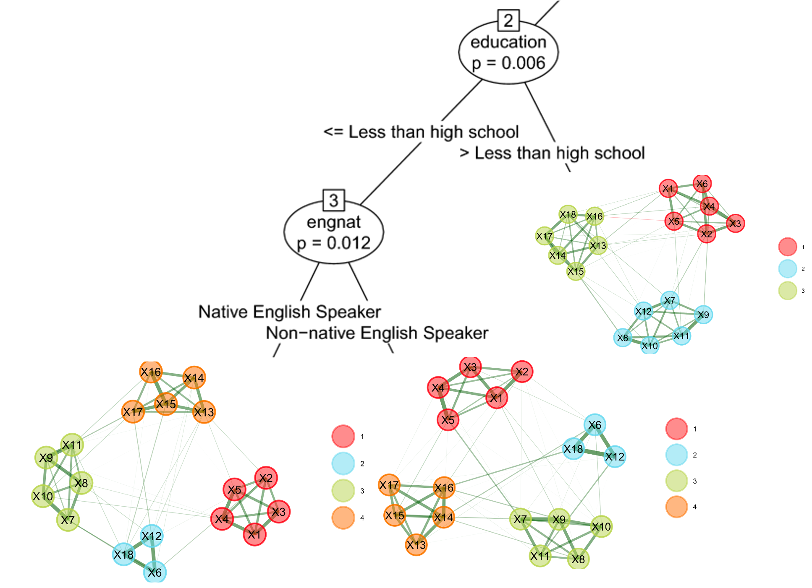

In this project, we develop new data-driven methods to a) investigate measurement invariance more holistically (i.e., with regard to many covariates and without constraining the analysis model too much), b) address measurement invariance at the early stages of scale development, c) inform a causal perspective on measurement, and d) ultimately make psychological measurements more robust and generalizable.

::: {#fig1 style="text-align:center;"}
\

*Figure 1:* Visualization of the new EGA trees approach that can be used to identify differences in the latent dimensionality as the cause of configural non-invariance.
:::

**Selected Publications and Preprints:**

Sterner, P., & Goretzko, D. (2024) Exploratory Factor Analysis Trees: Evaluating Measurement Invariance Between Multiple Covariates. Structural Equation Modeling: A Multidisciplinary Journal. <https://doi.org/10.1080/10705511.2023.2188573>

Sterner, P., Pargent, F., Deffner, D., & Goretzko, D. (2024) A Causal Framework for the Comparability of Latent Variables. Structural Equation Modeling: A Multidisciplinary Journal. <https://doi.org/10.1080/10705511.2024.2339396>

Sterner, P., de Roover, K., & Goretzko, D. (2025) New Developments in Measurement Invariance Testing-An Overview and Comparison of EFA-based Approaches. Structural Equation Modeling: A Multidisciplinary Journal. <https://doi.org/10.1080/10705511.2024.2393647>

Straub, N., Goretzko, D., & Sterner, P. (2025) Assessing Measurement Invariance with Exploratory Factor Analysis Trees: A Practical Guide. European Journal of Psychological Assessment. <https://doi.org/10.1027/1015-5759/a000898>

Goretzko, D., & Sterner, P. (2025). Exploratory Graph Analysis Trees-A Network-based Approach to Investigate Measurement Invariance with Numerous Covariates. Psychological Methods. <https://doi.org/10.1037/met0000796>

Schuhbeck, T. M. B., Sterner, P., & Goretzko, D. (2025). Quantifying Measurement Non-Invariance Beyond Simple Structure: The Closed Formulas of Universal Effect Size Measures for MI. Structural Equation Modeling: A Multidisciplinary Journal. <https://doi.org/10.1080/10705511.2025.2570447>

Sterner, P., Pargent, F., & Goretzko, D. (2026). Don’t let MI be misunderstood: Measurement invariance is more than a statistical assumption. Current Research in Ecological and Social Psychology. <https://doi.org/10.1016/j.cresp.2025.100261>

Goretzko, D., Howard, M. C., & Sterner, P. (2026). Investigating Measurement Invariance for Multiple Covariates in Organizational Research using EFA and CFA Trees. Journal of Applied Psychology. <https://doi.org/10.1037/apl0001368>

