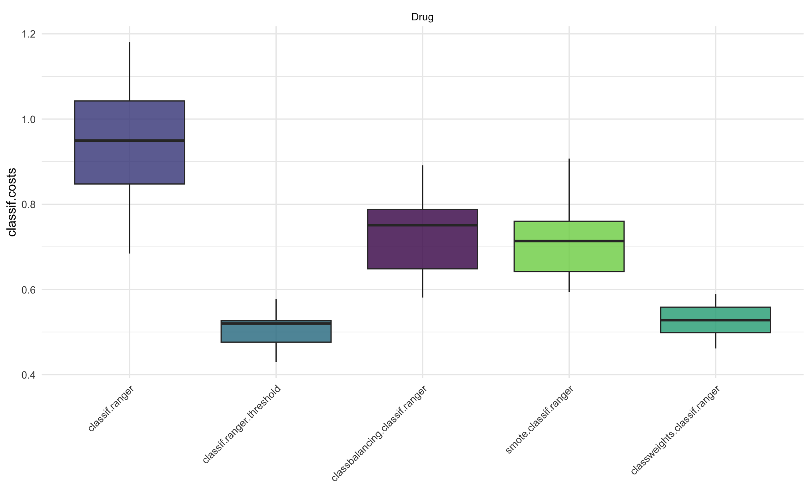

Besides using machine learning methods in combination with common psychometrics and latent variable modeling, the MMLL also provides guidance on how to apply machine learning techniques in psychological research. This includes tutorial papers on topics such as *cost-sensitive learning* (CSL), preprocessing pipelines for sensing data, or applications in specific contexts like recruiting. Furthermore, our team is interested in investigating challenges and potential pitfalls when using machine learning models in psychology.

::: {#fig1 style="text-align:center;"}
\

*Figure 1:* Examplary CSL application based on Sterner et al. (2025).
:::

**Selected Publications and Preprints:**

Sterner, P., Goretzko, D., & Pargent, F. (2025). Everything has its price: Foundations of cost-sensitive machine learning and its application in psychology. Psychological Methods, 30(1), 112-127. <https://doi.org/10.1037/met0000586>

Schoedel, R., Sust, L., Sterner, P., & Goretzko, D. (2026). From Digital Data to Psychological Insights: Making Sense of Mobile-Sensing Data through Integrative Preprocessing Pipelines. Psychometrika, 1–28. <https://doi.org/10.1017/psy.2026.10083>

Goretzko, D., & Israel, L. S. F. (2021). Pitfalls of machine learning-based Personnel Selection. Journal of Personnel Psychology. <https://doi.org/10.1027/1866-5888/a000287>

Hilbert, S., Coors, S., Kraus, E., Bischl, B., Lindl, A., Frei, M., ... & Stachl, C. (2021). Machine learning for the educational sciences. Review of Education, 9(3), e3310. <https://doi.org/10.1002/rev3.3310>

Sterner, P., Kim, E., & Goretzko, D. (under review) Predicting psychological constructs from biased measurements: The impact of non-invariant targets in machine learning. Arxiv Preprint: <https://osf.io/download/47fu3/>
